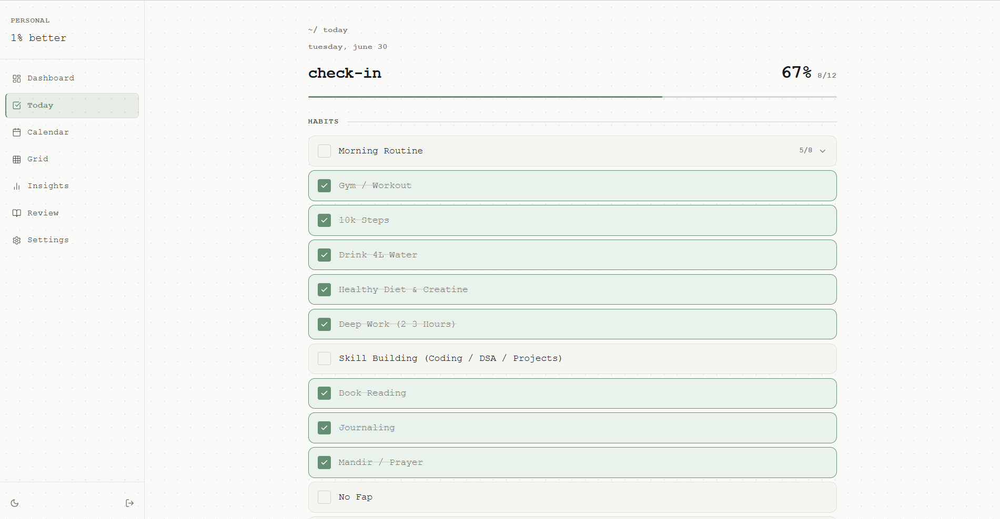
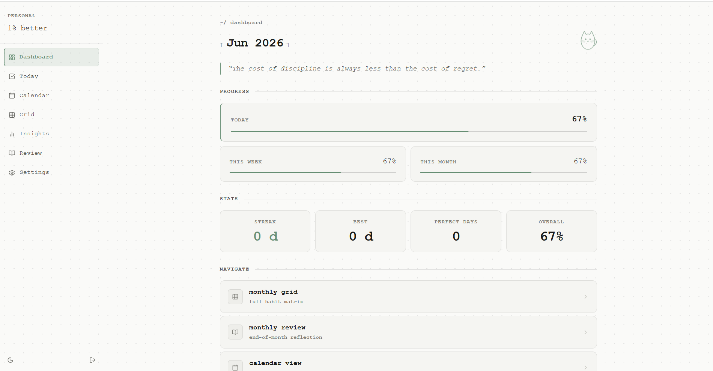

# 1% Better — Personal Habit Tracker

> Getting 1% better every day.

A premium, single-user habit tracker PWA built with Next.js 16, TypeScript, Tailwind CSS, Framer Motion, Supabase, and Recharts. Designed for daily use on both mobile and desktop, with a calm, paper-and-terminal-inspired design system: monospace typography, hairline dividers, a faint dotted-notebook background, and a single muted accent color.

This is a personal tool, not a multi-user product — built to replace a printed monthly paper habit tracker with a flexible, statistics-driven digital version.

## Features

- **PIN lock screen** — secure, phone-style 4-digit keypad (PIN stored server-side only, never in code or git)
- **Fully flexible habits** — add, rename, reorder, archive, and convert habits between simple checkbox and multi-step checklist types, live from Settings, no redeploy required
- **Today check-in** — tap to complete habits, auto-save wellbeing data (mood, energy, sleep, weight, screen time, notes); designed to take 2–3 minutes
- **Checklist habits** — expandable sub-items (e.g. Morning Routine, Night Routine) that auto-sync parent habit completion
- **Monthly Grid** — digitized paper habit tracker grid with sticky columns and a bottom score row, matching the original physical tracker layout
- **Calendar view** — heat-map shading by daily completion %, click any day to view or edit its full entry
- **Dashboard** — animated stats: today/weekly/monthly progress, current streak, longest streak, perfect days, overall completion %, daily rotating quote
- **Insights** — line + bar charts, perfect/missed days, best/worst performance runs
- **Monthly Review** — reflection journal with auto-calculated stats (best/worst habit, consistency rates), goals carry forward automatically into the next month
- **Settings** — habit CRUD with drag-and-drop reorder, quotes manager, theme toggle
- **PWA** — installable to home screen, standalone full-screen mode, dark/light theme

## Tech Stack

| Layer | Technology |
|-------|------------|
| Framework | Next.js 16 (App Router) + TypeScript |
| Styling | Tailwind CSS + Vanilla CSS tokens |
| Animation | Framer Motion |
| Database | Supabase (Postgres) |
| Auth | iron-session (httpOnly cookie, PIN) |
| Charts | Recharts |
| Drag & Drop | @dnd-kit |
| Validation | Zod |
| Deployment | Vercel |

## Setup

### 1. Clone and Install

```bash
git clone <your-repo>
cd habit-tracker
npm install
```

### 2. Create Supabase Project

1. Go to [supabase.com](https://supabase.com) and create a new project.
2. In the SQL Editor, run the migration file: `supabase/migrations/001_initial_schema.sql`.

### 3. Configure Environment Variables

Copy the example file and fill in your own values:

```bash
cp .env.local.example .env.local
```

Edit `.env.local`:

```env
NEXT_PUBLIC_SUPABASE_URL=https://YOUR_PROJECT_ID.supabase.co
SUPABASE_SERVICE_ROLE_KEY=your-service-role-key
APP_PIN=choose-your-own-4-digit-pin
SESSION_SECRET=your-very-long-random-secret-at-least-32-characters
```

- **`NEXT_PUBLIC_SUPABASE_URL`** — from Supabase Dashboard → Settings → API
- **`SUPABASE_SERVICE_ROLE_KEY`** — from Supabase Dashboard → Settings → API (`service_role`, keep secret)
- **`APP_PIN`** — your personal 4-digit lock PIN. Choose your own value here and in Vercel's environment variables; never commit a real PIN to a file tracked by git, even in a private repo.
- **`SESSION_SECRET`** — generate with `openssl rand -base64 32`

> **Security note:** `.env.local` is gitignored and must never be committed. The `APP_PIN` and `SESSION_SECRET` should exist only as environment variables — locally in `.env.local`, and in Vercel's Environment Variables dashboard for production. If you ever suspect either value has leaked, rotate both immediately.

### 4. Run Locally

```bash
npm run dev
```

Open [http://localhost:3000](http://localhost:3000) — you'll be redirected to the PIN screen.

### 5. Seed Initial Data

After entering your PIN and logging in, run the seed endpoint once to populate the default 13 habits and starter motivational quotes:

```bash
curl -X POST http://localhost:3000/api/seed \
  -H "Cookie: hbt_session=<your-session-cookie>"
```

Or simply visit the app, log in, then open your browser's DevTools console and run:

```javascript
fetch('/api/seed', { method: 'POST' }).then(r => r.json()).then(console.log)
```

This only needs to be run once, on first setup. Re-running it should not duplicate existing habits/quotes (confirm this is idempotent before running it more than once).

### 6. PWA Icons

Place these files in `public/icons/`:
- `icon-192.png` — 192×192px
- `icon-512.png` — 512×512px
- `icon-maskable.png` — 512×512px with safe zone padding
- `apple-touch-icon.png` — 180×180px

Generate them at [maskable.app](https://maskable.app) or [realfavicongenerator.net](https://realfavicongenerator.net).

## Deploy to Vercel

1. Push your repo to GitHub (keep it **private** — this app holds personal data).
2. Import the repo into Vercel.
3. Add all environment variables from `.env.local` in Vercel's Project → Settings → Environment Variables.
4. Deploy.
5. Open the deployed URL on your phone and use "Add to Home Screen" for the full PWA experience.

After the first deploy, every `git push` to `main` triggers an automatic redeploy. Past deployments remain available in the Vercel dashboard for instant rollback if a change breaks something.

## Project Structure

```
habit-tracker/
├── app/
│   ├── (app)/           # Protected app routes
│   │   ├── page.tsx     # Dashboard
│   │   ├── today/       # Daily check-in
│   │   ├── calendar/    # Calendar heat-map
│   │   ├── grid/        # Monthly grid
│   │   ├── insights/    # Analytics charts
│   │   ├── review/      # Monthly review journal
│   │   └── settings/    # Habit/quote management
│   ├── (auth)/pin/      # PIN lock screen
│   ├── api/             # Server-only API routes
│   └── globals.css      # Design system tokens
├── components/          # All React components
├── lib/
│   ├── auth/            # Session management
│   ├── db/              # Supabase query functions
│   └── supabase/        # Client + type definitions
├── actions/             # Next.js Server Actions
├── supabase/migrations/ # SQL schema
└── proxy.ts             # Auth guard (Next.js 16)
```

## Design System

- **Typography:** single monospace font throughout (e.g. JetBrains Mono / IBM Plex Mono)
- **Background:** pale neutral with a faint dotted-notebook texture, warm-charcoal equivalent in dark mode
- **Color:** one muted accent color only, used sparingly for progress, streaks, and active states
- **Structure:** thin hairline dividers and bracket/breadcrumb notation (`~/ dashboard`, `[ streak ]`) instead of heavy cards or shadows
- **Motion:** short, spring-based "pop" animations on completion and load; a small line-art cat companion that reacts to the cursor on desktop and to taps on mobile

## Screenshots

<p align="center">
  
</p>
<p align="center">
  
</p>

## Data Model Notes

- Habits are fully editable records, not hardcoded — see `supabase/migrations/001_initial_schema.sql` for the `habits` / `habit_subitems` schema.
- Archiving a habit removes it from future check-ins but preserves all historical completions; deletion is intentionally not supported to protect data integrity.
- Daily completion % is calculated only against habits that were active on that specific date, so editing the habit list never retroactively changes past scores.
- Streak = consecutive **Perfect Days** (100% of that day's active habits completed), not just days with any entry logged.

## Philosophy

> *"You don't rise to the level of your goals, you fall to the level of your systems."*

This app is a system. Use it every day.
